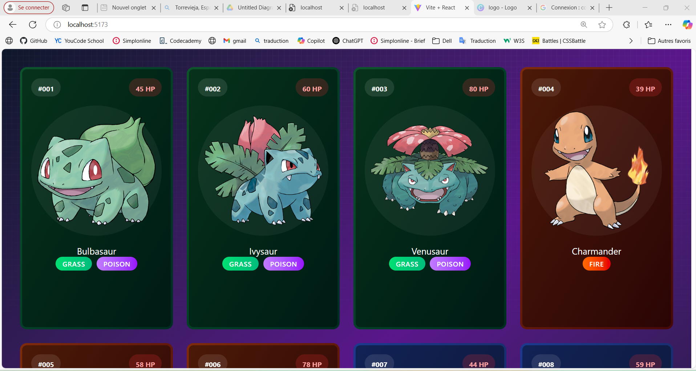
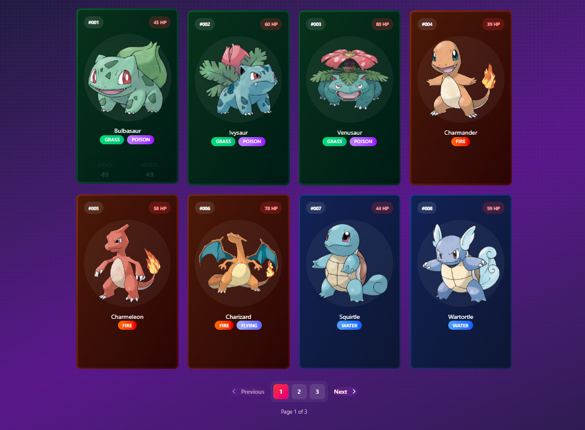
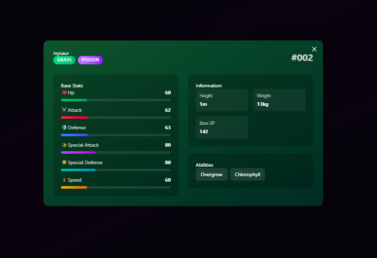

# 🌟 PokéVerse - Modern Pokemon Explorer

<div align="center">
  

  [](https://reactjs.org/)
  [](https://vitejs.dev/)
  [](https://tailwindcss.com/)
  [](https://tanstack.com/query/latest)
</div>

## 🌈 Features

- 🎨 Modern, responsive design with glassmorphism effects
- ⚡ Fast and efficient data fetching with React Query
- 🎭 Beautiful animations and transitions
- 🔍 Detailed Pokemon information with stats visualization
- 🖼️ Multiple sprite variations (Default, Shiny, Animated)
- 🎯 Type-based theming and visual effects
- 📱 Mobile-friendly interface

## 🛠️ Technologies Used

### Core
- React 18.2.0
- Vite 5.0.0
- TailwindCSS 3.4.0

### State Management & Data Fetching
- TanStack Query (React Query) 5.0.0
- Axios

### Routing
- React Router DOM 6.20.0

### Animations
- Framer Motion
- Custom CSS Animations

### Development Tools
- ESLint
- Prettier
- PostCSS

## 📸 Screenshots

<div align="center">
  
  
</div>

## 🚦 Getting Started

1. **Clone the repository**
```bash
git clone https://github.com/Mahjoubech/PokéVerse.git
cd PokéVerse
```

2. **Install dependencies**
```bash
npm install
```

3. **Start development server**
```bash
npm run dev
```

4. **Build for production**
```bash
npm run build
```

## 📁 Project Structure

```
PokéVerse/
├── src/
│   ├── components/
│   │   ├── Navbar.jsx
│   │   ├── PokemonCard.jsx
│   │   ├── PokemonDetail.jsx
│   │   ├── PokemonList.jsx
│   │   └── ...
│   ├── services/
│   │   └── api.js
│   ├── utils/
│   │   └── pokemonUtils.js
│   ├── styles/
│   │   └── globals.css
│   └── App.jsx
├── public/
│   ├── pokeball.svg
│   ├── pattern.svg
│   └── screenshots/
└── package.json
```

## 🎨 Color Scheme

```css
// Primary Colors
--primary: #EF4444;     // Red-500
--secondary: #3B82F6;   // Blue-500
--accent: #10B981;      // Emerald-500

// Background Colors
--bg-primary: #111827;  // Gray-900
--bg-secondary: #1F2937; // Gray-800

// Text Colors
--text-primary: #F9FAFB;  // Gray-50
--text-secondary: #D1D5DB; // Gray-300
```

## 🤝 Contributing

1. Fork the Project
2. Create your Feature Branch (`git checkout -b feature/AmazingFeature`)
3. Commit your Changes (`git commit -m 'Add some AmazingFeature'`)
4. Push to the Branch (`git push origin feature/AmazingFeature`)
5. Open a Pull Request

## 📜 License

This project is licensed under the MIT License - see the [LICENSE](LICENSE) file for details.

## 👤 Author

**Mahjoubech**
- Created: 2025-04-18
- GitHub: [@Mahjoubech](https://github.com/Mahjoubech)

## 🙏 Acknowledgments

- [PokeAPI](https://pokeapi.co/) for the comprehensive Pokemon data
- Pokemon images and assets belong to Nintendo/Game Freak
- Icons from [Heroicons](https://heroicons.com/)

---

<div align="center">
  Made with ❤️ by <a href="https://github.com/Mahjoubech">Mahjoubech</a>
</div>
